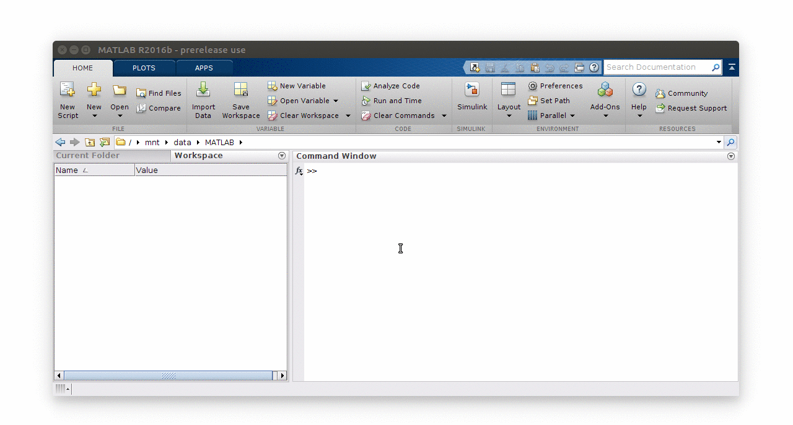

# Table of contents
- [Project Summary](#Summary)
- [Installation](#Installation)
- [Getting started](#Start)
- [License](#License)
- [Contributing](#Contributing)
- [CodeOfConduct](#CodeOfConduct)
- [Road Map](#RoadMap)

## Project summary 
GIBBON (The Geometry and Image-Based Bioengineering add-On) is an open-source MATLAB toolbox by [Kevin M. Moerman](kevimoerman.org) and includes an array of image and geometry visualization and processing tools and is interfaced with free open source software such as [TetGen](http://wias-berlin.de/software/tetgen/), for robust tetrahedral meshing, and [FEBio](http://febio.org/) for finite element analysis. The combination provides a highly flexible image-based modelling environment and enables advanced inverse finite element analysis.

## Installation 

Follow the steps below.

1. Add the toolbox folder (e.g. for SVN the patch typically ends in `..\gibbon\trunk`) including subdirectories to the MATLAB path (see MATLAB home tab and the `Add path` button, or see MATLAB help). To permanently add GIBBON to the path save the added path definitions.

2. To integrate the GIBBON help and demonstrations in MATLAB run the function `createHelpDemoDocumentation` (found in the createHelpDoc folder, after adding GIBBON to the path it can be run from the command window).

3. Restart MATLAB to allow it to update help and documentation definitions.
4. To access the help documentation from MATLAB click on the HELP browser then click `Supplemental Software` as shown below. This will open the toolbox help and documentation which is now searchable and integrated into MATLAB

### Setting up third party packages
* **FEBio** FEBio is a finite element package. FEBio is not provided with GIBBON. Install a desired release (see: http://febio.org/) and change the path name to FEBio in the configuration file `FEBioPath.txt`found in the `config` folder. However the config path can also be ignored by always directly specifying the location in the code (see FEBio related demos).
* **TetGen** TetGen is a tetrahedral meshing package. TetGen is provided with GIBBON and can be found in `...\GIBBON\lib_ext\tetGen`. No special treatment should be required to run and use TetGen. If an alternative release is required visit the [TetGen website](http://wias-berlin.de/software/tetgen/), and replace the existing files as desired.
* **export_fig** export_fig is not included with GIBBON. These figure exporting MATLAB tools (used by the GIBBON 'efw' function) can be found on [GitHub](https://github.com/altmany/export_fig) or on [the MathWorks file exchange](http://www.mathworks.com/matlabcentral/fileexchange/23629-export-fig).

## Getting started 
* The `lib` folder contains all GIBBON's functions and the `lib_ext` contains "external functions" i.e. functions developed by others included with GIBBON. The `doc` folder contains the help&documentation, and demo files which when "published" (using MATLAB's publish functionality) create the .html documentation files (found in `doc/html`) which are integrated in MATLAB.
* The source for the help information for any function `functionName` is named `HELP_functionName`, and  the source for demos have `DEMO_` as part of the name**. Therefore if one is interested in reproducing or starting off from codes in the help and documentation simply start typing code names starting in `HELP_` or `DEMO_` in the MATLAB command window, e.g. `HELP_ind2patch` can be used to generate the help information for the `ind2patch` function. Users can start editing the file by typing `open HELP_ind2patch` in the command window. By publishing (MATLAB publish functionality) the HELP_ or DEMO_ files .html files are created in the `doc\html` folder. As such if users alter/contribute code in the `lib` folder and generate associated `HELP_` or `DEMO_` files, new help and documentation is added. For new help and documentation to become known and visible to MATLAB run the `createHelpDemoDocumentation` function and restart MATLAB.
* Many of the `DEMO_` files focus on the use of FEBio. The demo `DEMO_FEBio_block_uniaxial_compression` for instance features a simple cube that undergoes a 30% compression. Other demos focus on different load types, single versus multi-step analysis, different materials and inverse analysis (e.g. `DEMO_FEBio_iFEA_uniaxial_01`).

## License 
 [BSD-3-Clause](https://github.com/Kevin-Mattheus-Moerman/GIBBON/blob/master/LICENSE)

## Contributing 
Refer to the [CONTRIBUTING](CONTRIBUTING.md).

## Code of conduct 
Refer to the [CODE_OF_CONDUCT](CODE_OF_CONDUCT.md).

## Roadmap 
Coming soon
