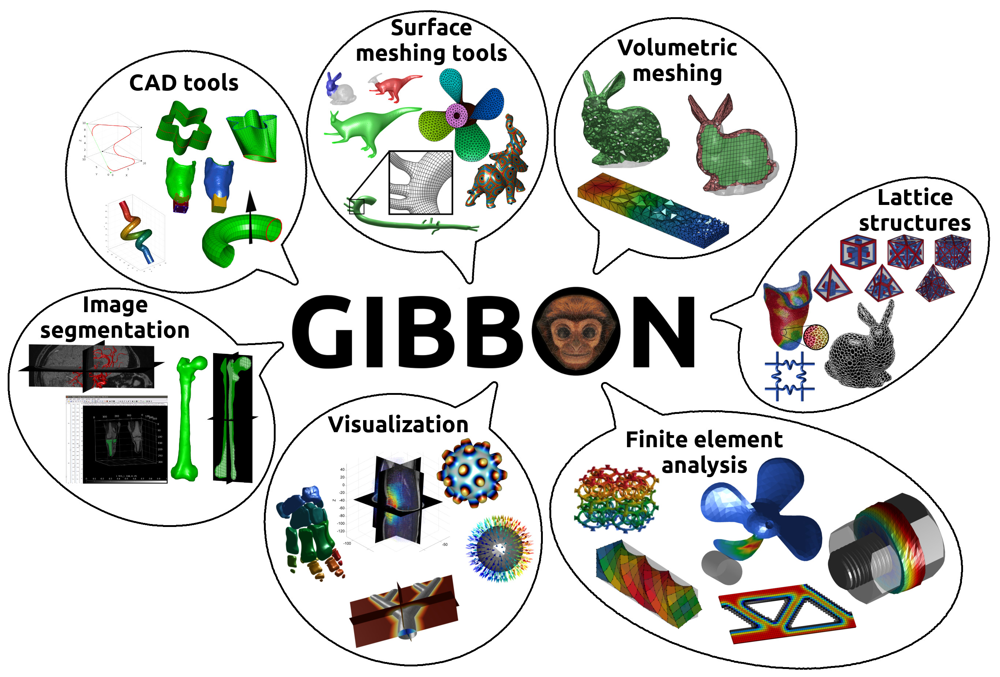

# Summary
[GIBBON](www.gibboncode.org) (The Geometry and Image-Based Bioengineering add-On) is an open-source MATLAB toolbox for segmentation, image-based modeling, visualization, meshing, and finite element analysis. GIBBON includes an array of image and geometry visualization and processing tools and is interfaced with free open source software such as [TetGen](http://wias-berlin.de/software/tetgen/), for robust tetrahedral meshing, and [FEBio](http://febio.org/) for finite element analysis. The combination provides a highly flexible image-based modelling environment and enables advanced inverse finite element analysis.   
{:width="100%"}

# Application highlights   
- [Segmentation](#Segmentation)  
- [Meshing](#Meshing)  
- [Finite element analysis](#FEA)
- [Geometric tools](#Geometric)
- [Visualization](#Visualization)    

## Segmentation      
The `imx.m` function provides a graphical user interface for segmenting 3D image data. The demo below stems from: `HELP_imx`.   
{:width="70%"}

## Meshing    
Multi-material tetrahedral meshing is enabled using [TetGen](http://wias-berlin.de/software/tetgen/). The TetGen interface is based on the `runTetGen.m` function. The demo below comes from the help file `HELP_runTetGen`.
{:width="70%"}

## Finite Element Analysis    
Finite element analysis is enabled through the FEBio interface (see also the `runMonitorFEBio` function.
The image below is for large strain analysis of a twisting bar and stems from the demo `DEMO_FEBio_bar_twist`. Other `DEMO_FEBio_...` files cover uni-axial tension/compression, bending, indentation, viscoelastic analysis, contact and indentation problems, multi-generational materials for pre-load analysis.   
{:width="70%"}

## Geometric tools    
Models, `geoSphere`   
Mesh conversions `hex2tet`   
Refinement, resampling `subTri`, `triSurfaceRemesh`     
Lattice structures  `element2lattice`   
CAD (computer aided design) tools `polyExtrude`, `polyLoftLinear`, `sweepLoft`

## Visualization     
`cFigure` `vcw` `im2patch` `gpatch` `quiver3DPatch` `fourthOrderTensorView`

# Setting up GIBBON
## Installation
The GIBBON website (and the `readme.md` file) contains detailed installation instructions. For basic use only the GIBBON folder and sub-directories need to be added to the MATLAB path. For use with FEBio for finite element analysis FEBio needs to be installed and the patch to FEBio needs to be provided. If exporting of figures to images and animations is of interest the export_fig library needs to be downloaded and added to the MATLAB path also.

## Third party packages
* __FEBio__ [@Maas2012], a finite element solver, which enables finite element analysis with GIBBON. FEBio is available through [FEBio](http://febio.org/) website.
* __TetGen__, an open source tetrahedral meshing package [@Si2015]. TetGen is utilized in GIBBON for tetrahedral meshing, see also the `runTetGen.m` function. TetGen is included with GIBBON but alternative versions may be available through the [TetGen](http://wias-berlin.de/software/tetgen/) website.
* __export_fig__, a MATLAB library for exporting publication quality figures. export_fig is used in GIBBON with the `efw.m` (export figure widget) to export figures, and with `anim8.m` (animation function) to export animated .gif files. export_fig can be obtained via the [export_fig](https://github.com/altmany/export_fig) GitHub repository.

## Use of GIBBON in research
