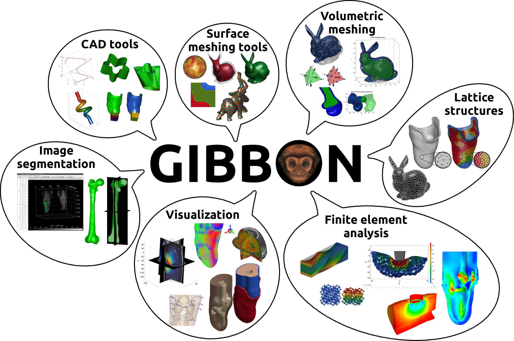

# Summary
[GIBBON](https://github.com/gibbonCode/GIBBON), which loosely stands for Geometry and Image-Based Bioengineering add-ON, is an open-source MATLAB® toolbox providing a single open-source framework for many aspects of computational (bio)mechanics such as: image segmentation, meshing, boundary conditions specification, finite element analysis (FEA), and visualization. A schematic of the core functionality of GIBBON is shown in the figure below.

Below is a more detailed discussion of the core functionality where reference is made to implementations in the documentation.

* **Image segmentation**: In patient-, or subject-specific biomechanics, the geometry information is often derived from image data (e.g. Magnetic Resonance Imaging (MRI)). GIBBON offers image filtering and smoothening methods, and has a graphical user interface for 3D image segmentation (see `HELP_imx.m`). The segmented image data can be converted to 3D surface models which can be meshed for FEA.
* **Computer Aided Design (CAD) tools**: Sometimes geometry is instead imported or designed. Using GIBBON geometry can be imported from common mesh based CAD files (such as STL, see `HELP_import_STL`). However, several CAD style commands have also been implemented in GIBBON such as polygon rounding, revolution (see `HELP_polyRevolve`), extrusion (see `HELP_polyExtrude`), and sweeping and lofting (see `HELP_polyLoftLinear` and `HELP_sweepLoft`).
* **Surface meshing tools**: 2D multi-region triangular meshing (see for instance `HELP_regionTriMesh2D` and `HELP_multiRegionTriMeshUneven2D`), resampling meshes geodesically (see `DEMO_geodesic_remeshing`), smoothening (`DEMO_surface_smooth_methods`), and surface mesh refinement (see `HELP_subtri`, `HELP_subTriDual` and `HELP_subQuad`), mesh type conversions (see `HELP_tri2quad`, `HELP_quad2tri`), and mesh dual computation (see `HELP_patch_dual`). Geometries can also be exported to the STL format e.g. for computer aided manufacture and 3D printing.
* **Volumetric meshing**: Tetrahedral meshing (and constrained Delaunay tessellation) of multi-region domains is enabled through an interface with the [TetGen](http://wias-berlin.de/software/tetgen/) [@Si2015] package (`HELP_runTetGen`). Hexahedral meshes for some geometry types can be directly coded (e.g. sphere `HELP_hexMeshSphere`, boxes `HELP_hexMeshBox` and lattices `HELP_element2HexLattice`). For general input surfaces multi-region mixed tetrahedral-hexahedral meshing is also available (`DEMO_MixedTetHexMeshing`).
* **Lattice structures**: Various lattice structure tools have been implemented. One method to generate surface geometry for lattices is the use of triply-periodic functions (see `HELP_triplyPeriodicMinimal` and `DEMO_FEBio_trabeculae_compression`). Functions to convert element descriptions, such as tetrahedral and hexahedral elements, to lattice structures have also been implemented (`HELP_element2lattice` and `HELP_element2HexLattice`). These allow for the creation of 3D boundary conforming lattice structures on arbitrary input geometry. Exporting of hexahedral elements is also supported allowing for FEA on the created lattice structures.
* **Finite element analysis (FEA)**: GIBBON interfaces with the free software [FEBio](http://febio.org/) [@Maas2012] for FEA (source code available on FEBio website). GIBBON can be used as a pre- and post- processor for FEA as it enables the code based development of meshes, boundary conditions, and input files. FEBio files can be directly exported based on dedicated MATLAB® structures. Furthermore, GIBBON can be used to start and control FEBio simulations. As such, iterative and inverse FEA (e.g. based on MATLAB® optimization routines) is also enabled. All `DEMO_FEBio_...` files contain FEBio examples, `DEMO_FEBio_iFEA_uniaxial_01` is a simple inverse FEA example.
* **Visualization**  
GIBBON expands the standard MATLAB® visualization capabilities by adding 3D image and voxel visualization (see `HELP_im2patch` and `HELP_sliceViewer`), meshed geometries (`HELP_gpatch` and `HELP_meshView`), finite element models (`HELP_element2patch`), and colormapped vector data (`HELP_quiverVec`), and all visualization methods enable multiple colormaps to be used in each figure or axis window. Furthermore GIBBON offers a custom figure window `cFigure` containing 3D rotation options (`HELP_vcw`) that mimic CAD behavior of 3D scene rendering, and high quality figure exporting options (`HELP_efw`). Advanced graphics animation creation and exporting capabilities through a figure window based GUI are also enabled (see `HELP_anim8`).

To date GIBBON has been used for image analysis and visualization [@Moerman2012a], continuum mechanics[@Moerman2016], soft tissue biomechanics ([@Cooney2015] [@Takaza2013]), and subject-specific and inverse FEA of soft biological soft tissue _in-vivo_ ([@Moerman2017] [@Sengeh2016]). Current research with GIBBON is focused on subject-specific computational modeling for the automated generation of 3D printable prosthetic devices with optimized and spatially varying mechanical behavior [@Moerman2016c].

# Acknowledgements
GIBBON has not received dedicated funding but development of GIBBON has taken place as part of several other research projects. As such GIBBON has been partially financially supported by: Science Foundation Ireland (Research Frontiers Grant No. 06/RF/ENMO76) in the period 2006-2010, the Dutch Technology Foundation (project 12398) in the period 2012-2015, the Robert Wood Johnson Foundation (RWJF-ID72293) in the period 2015-2016, National Institute of Health (R01EB024531-01) presently.

# References
